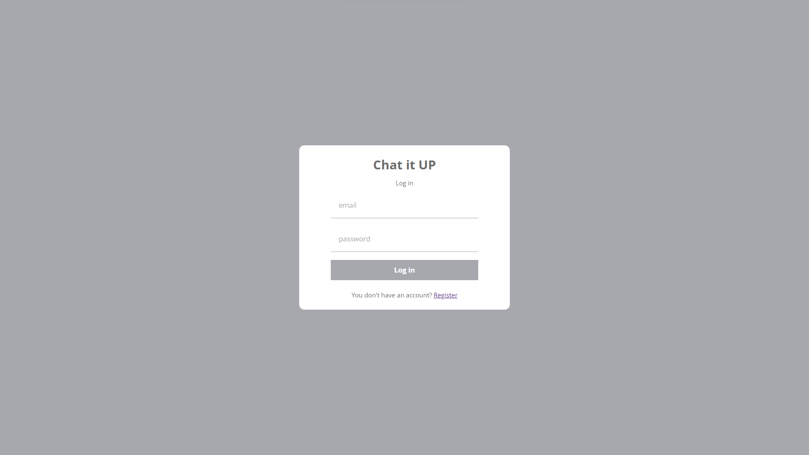

# To use the live application use the link below

[Redirect to Chat-it-Up Live](https://chat-it-up-f6671.web.app/)

## Description

Chat-it-up is chat application that alows multiple user login, a user can find any other user registered in the application and chat with them as well as share files with each other, it keeps the old chat saved so everytime a user can login and restart the conversation with others from exactly where they left off.

### Deployed

This app is deployed to [firebase](https://chat-it-up-f6671.web.app/).

### Installing the Chat Application in your local system

After downloading or cloning the repo perform the following steps:
* Install NodeJs and npm packages on your system.
  * To install Nodejs visit [Node.js](https://nodejs.org) and download.
  * Run ```npm install``` on terminal to install npm packages.
  * Run ```npm add react-router-dom ``` to install npm package for dynamic routing.
* Now to make sure sass the file works install sass using ```npm install sass```
* Install react scripts using ```npm install react-scripts```
* Setup firebase

### `npm start`

Runs the app in the development mode.\
Open [http://localhost:3000](http://localhost:3000) to view it in your browser.

The page will reload when you make changes.\
You may also see any lint errors in the console.

### Chat-it-up Regiter Interface:


### Chat-it-up Login Interface:


### Chat-it-up Chat Interface:


## Built With

- [Node.js](https://nodejs.org/en/) - JavaScript runtime
- [Scss](https://sass-lang.com/) - Styling
- [fireabse](https://firebase.google.com/) - Database and Hosting
